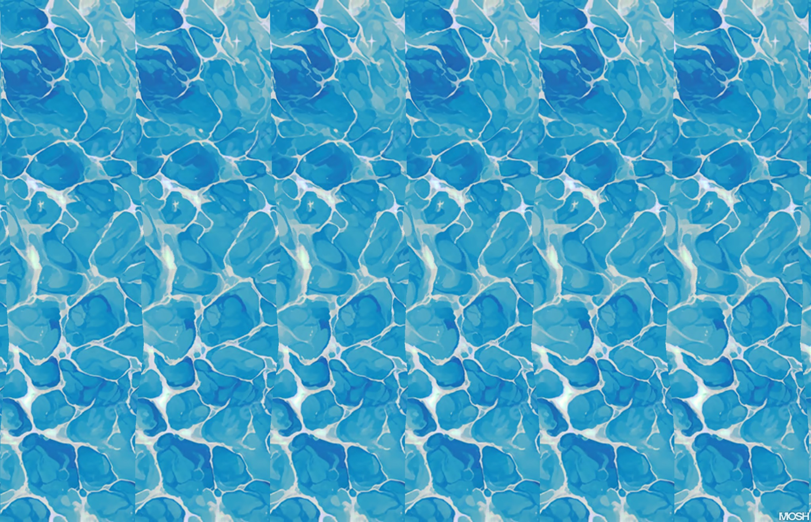
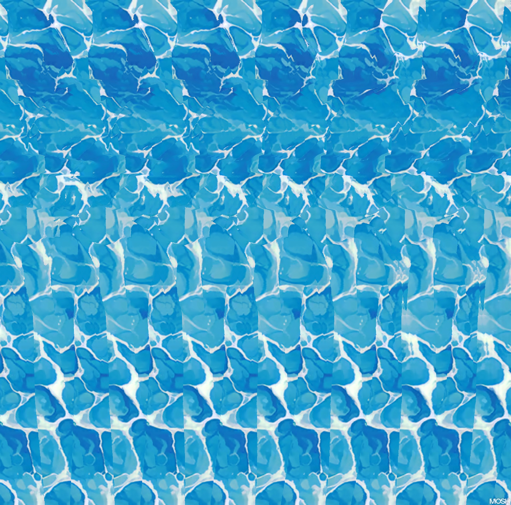
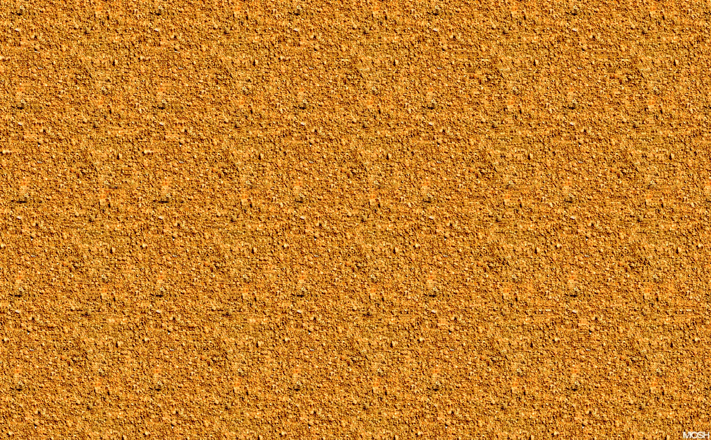

# Magic Eye stereogram genreator using a center out algorithm
Upload a depthmap and texture, set the depth and number of repeating strips

### [Try It Out](https://camelcasesensitive.github.io/Center-Out-Stereogram-Generator/)

  
  
  
  

